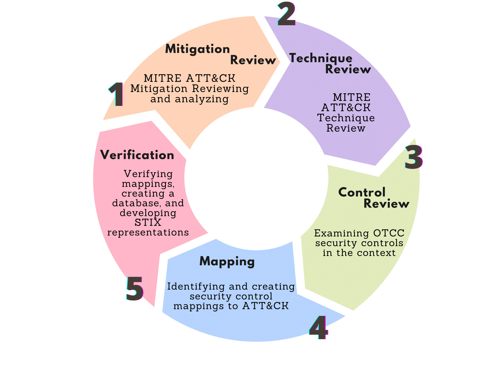

# OTCC Effectiveness Evaluation

This repository contains the research and analysis for evaluating the effectiveness of Saudi Arabia's Operational Technology Cybersecurity Controls (OTCC) in the context of Industrial Control Systems (ICS) security. The project involves a comparative analysis with established international standards, specifically NIST SP 800-82 Rev. 3 and IEC 62443, as well as mapping to the MITRE ATT&CK for ICS framework.

## Project Overview

The main objectives of this research are:

1. Conduct a comprehensive review of the OTCC framework
2. Perform a comparative analysis with NIST SP 800-82 Rev. 3 and IEC 62443
3. Map OTCC controls to the MITRE ATT&CK for ICS matrix
4. Evaluate the effectiveness of OTCC in addressing ICS cybersecurity threats
5. Provide recommendations for enhancing ICS cybersecurity based on the findings

## Repository Structure

- `/analysis`: Jupyter notebooks and scripts for data analysis
- `/data`: Datasets and mappings
- `/results`: Visualizations and final analysis outputs
- `/docs`: Documentation and research papers (not done yet ) 

## Methodology

The research employs a mixed-methods approach, combining qualitative comparative analysis with quantitative mapping techniques. Key components include:

- Systematic review of cybersecurity standards
- Control mapping using the MITRE ATT&CK for ICS framework
- Simulated ICS environment for practical evaluation
- Statistical analysis of control coverage and effectiveness

## License

This project is licensed under the MIT License - see the [LICENSE](LICENSE) file for details.
